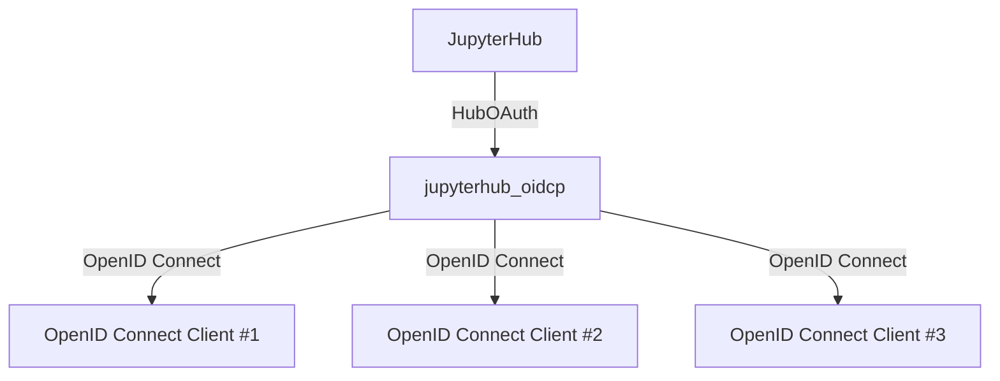

# OID Connect Service for JupyterHub

This is a JupyterHub service that adds support for OpenID Connect providers to the JupyterHub.




jupyterhub_oidcp behaves as an OpenID Connect provider and allows JupyterHub to authenticate users using OpenID Connect. OpenID Connect clients can be registered with jupyterhub_oidcp to use user authentication by JupyterHub with the OpenID Connect protocol.

## How to use

testing/jupyterhub_config.py

```python
from jupyterhub_oidcp import configure_jupyterhub_oidcp

c.JupyterHub.load_roles = [
    {
        'name': 'user',
        'scopes': ['self', 'access:services'],
    }
]

configure_jupyterhub_oidcp(
    c,
    base_url="http://localhost:8000",
    internal_base_url="http://hub:8000",
    debug=True,
    services=[
        {
            "oauth_client_id": "TEST_CLIENT_ID",
            "api_token": "TEST_CLIENT_SECRET",
            "redirect_uris": ["http://localhost:9001/ep_openid_connect/callback"],
        }
    ],
    vault_path="./tmp/jupyterhub_oid/.vault",
)
```

## How to test

1. Clone this repository
2. Install the JupyterHub https://jupyterhub.readthedocs.io/en/latest/contributing/setup.html
3. Back to the directory 1. and run the following command:

```bash
jupyterhub -f testing/jupyterhub_config.py
```
