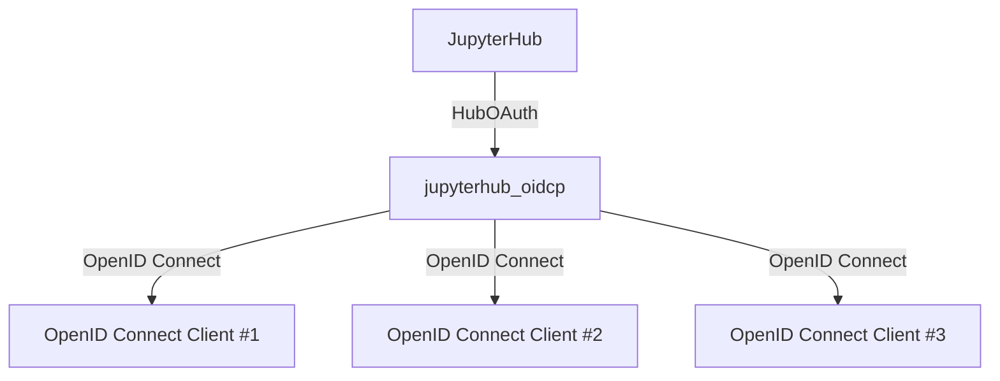

# OID Connect Service for JupyterHub

This is a JupyterHub service that adds support for OpenID Connect providers to the JupyterHub.




jupyterhub_oidcp behaves as an OpenID Connect provider and allows JupyterHub to authenticate users using OpenID Connect. OpenID Connect clients can be registered with jupyterhub_oidcp to use user authentication by JupyterHub with the OpenID Connect protocol.

## How to use

1. Install the package:

```bash
pip install git+https://github.com/NII-cloud-operation/jupyterhub-oidc-provider.git
```

2. Add the following configuration to the JupyterHub configuration file:

```python
from jupyterhub_oidcp import configure_jupyterhub_oidcp

c.JupyterHub.load_roles = [
    {
        'name': 'user',
        'scopes': ['self', 'access:services'],
    }
]

configure_jupyterhub_oidcp(
    c,
    base_url="http://localhost:8000",
    internal_base_url="http://hub:8000",
    debug=True,
    services=[
        {
            "oauth_client_id": "TEST_CLIENT_ID",
            "api_token": "TEST_CLIENT_SECRET",
            "redirect_uris": ["http://localhost:9001/ep_openid_connect/callback"],
        }
    ],
    vault_path="./tmp/jupyterhub_oid/.vault",
)
```

3. Run the JupyterHub

```bash
jupyterhub
```

### Configuration

The `configure_jupyterhub_oidcp` function accepts the following parameters:

- `c`: JupyterHub configuration object
- `base_url`: The base URL of the JupyterHub
- `internal_base_url`: The internal base URL of the JupyterHub
- `debug`: Enable debug mode
- `services`: A list of OpenID Connect clients that can authenticate users
- `vault_path`: The path to the vault file

jupyterhub_oidcp uses a vault directory to store the JWKs. The vault directory is created at the `vault_path` if it does not exist. The vault directory is used to store the JWKs for the OpenID Connect clients. The JWKs are used to sign the JWTs used in the OpenID Connect protocol.

### OpenID Connect Client Configuration

The `services` parameter is a list of OpenID Connect clients that can authenticate users. Each client is a dictionary with the following keys:

- `oauth_client_id`: The client ID of the OpenID Connect client
- `api_token`: The client secret of the OpenID Connect client
- `redirect_uris`: A list of redirect URIs for the OpenID Connect client

### Client Configuration

The OpenID Connect client must be configured to use the JupyterHub OIDCP service. The client must be configured with the following parameters:

- `issuer`: The issuer URL of the JupyterHub OIDCP service.

    - `http://jupyterhub_host/services/oidcp/`: The issuer URL of the JupyterHub OIDCP service for clients on the external network.
    - `http://jupyterhub_internal_host/services/oidcp/internal/`: The issuer URL of the JupyterHub OIDCP service for clients on the internal network.

- `client_id`: The client ID of the OpenID Connect client
- `client_secret`: The client secret of the OpenID Connect client

## How to test

1. Clone this repository
2. Install the JupyterHub https://jupyterhub.readthedocs.io/en/latest/contributing/setup.html
3. Back to the directory 1. and run the following command:

```bash
jupyterhub -f testing/jupyterhub_config.py
```
